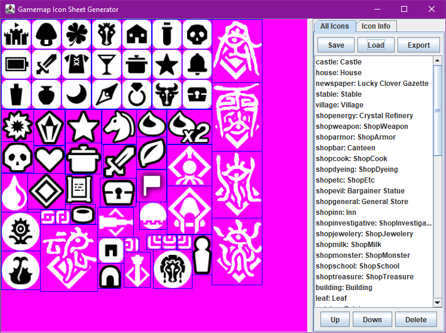

# Gamemap Icon Sheet Generator

Tool for generating icon sheets to be used by Gamemap

Features:
- Modifiable ordering of icons for display in Gamemap's icon list
- Projects savable to file to continue working on later
- Specify the sizing, cropping, and center of each icon
- Snapping of icons within the atlas view for easy arrangement

Requires Java 9 or newer to build and run